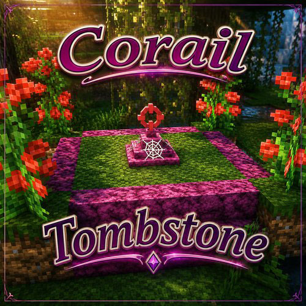

# Corail Tombstone
A Minecraft mod for the java version on Forge & Neoforge.

"Keeps safe your inventory items in graves on death, with many features for better survivability and exploration, in a medieval fantasy atmosphere related to the decorative grave & the haunting souls."

[CurseForge](https://www.curseforge.com/minecraft/mc-mods/corail-tombstone) | [Modrinth](https://modrinth.com/mod/corail-tombstone) | [Issues](https://github.com/Corail31/tombstone_lite/issues)

If the issue tracker is set to restrict new issues to contributors only, you can reach out via a private message on [CurseForge](https://www.curseforge.com/minecraft/mc-mods/corail-tombstone) instead.

*Special thanks to Gegy, Barteks2x, Raycoms & Runemoro for their advices.*
